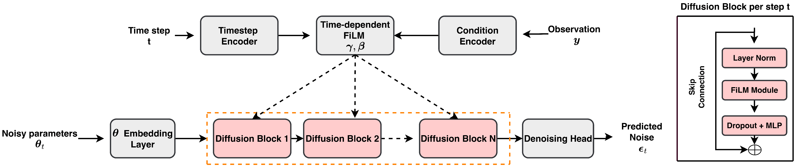

# ConDiSim: Conditional Diffusion Models for Simulation-Based Inference

This repository contains the implementation of conditional diffusion models for simulation-based inference tasks.

## Overview

The code implements a diffusion-based approach for posterior inference across multiple benchmark tasks including:
- SBIBM Benchmark Tasks
- Hodgkin-Huxley
- Vilar Oscillator

## Architecture



## Repository Structure

```
.
├── main.py                # Main training script
├── utils.py               # General utilities
├── metrics.py             # Evaluation metrics
├── plots/                 # Plotting scripts for each task
│   ├── 2moons.py
│   ├── gaussian_linear.py
│   ├── glm.py
│   ├── gmm.py
│   ├── lv.py
│   ├── sir.py
│   └── slcp.py
├── hh/                    # Hodgkin-Huxley specific code
│   ├── hh_main.py
│   └── hh_plots.py
├── vilar/                 # Vilar oscillator specific code
│   ├── vilar_dataset.py
│   ├── vilar_diffusion_train.py
│   ├── vilar_model_architecture.py
│   ├── vilar_plots.py
│   ├── vilar_sampling.py
│   ├── noise_scheduler.py
│   ├── sampling.py
│   └── train_utils.py
└── ECDF/                  # SBC diagnostic plots
    └── sbc_plots.py
```

## Requirements

- Python 3.10+
- PyTorch
- NumPy
- Matplotlib
- SciPy
- sbibm (for benchmark tasks) - https://github.com/sbi-benchmark/sbibm
- JAX (for Hodgkin-Huxley tasks)
- scoresbibm (for Hodgkin-Huxley tasks)
- bayesflow (for SBC diagnostics) - https://github.com/bayesflow-org/bayesflow

## Usage

Run the main training script:
```bash
python main.py
```

Generate plots for a specific task:
```bash
python plots/2moons.py
python plots/gaussian_linear.py
python plots/glm.py
python plots/gmm.py
python plots/lv.py
python plots/sir.py
python plots/slcp.py
```

Run Hodgkin-Huxley specific experiments:
```bash
python hh/hh_main.py
python hh/hh_plots.py
```

Run Vilar oscillator experiments:
```bash
python vilar/vilar_diffusion_train.py
python vilar/vilar_sampling.py
python vilar/vilar_plots.py
```

Generate SBC diagnostic plots:
```bash
python ECDF/sbc_plots.py
```

## Citation

If you use this code, please cite our paper:

```bibtex
@misc{nautiyal2025condisimconditionaldiffusionmodels,
      title={ConDiSim: Conditional Diffusion Models for Simulation Based Inference}, 
      author={Mayank Nautiyal and Andreas Hellander and Prashant Singh},
      year={2025},
      eprint={2505.08403},
      archivePrefix={arXiv},
      primaryClass={cs.LG},
      url={https://arxiv.org/abs/2505.08403}, 
}
```
